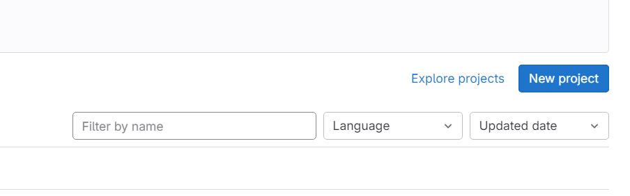
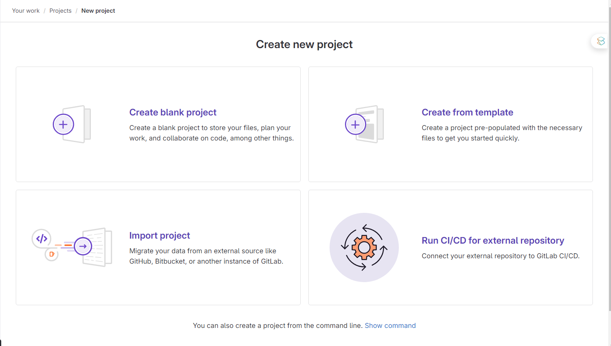
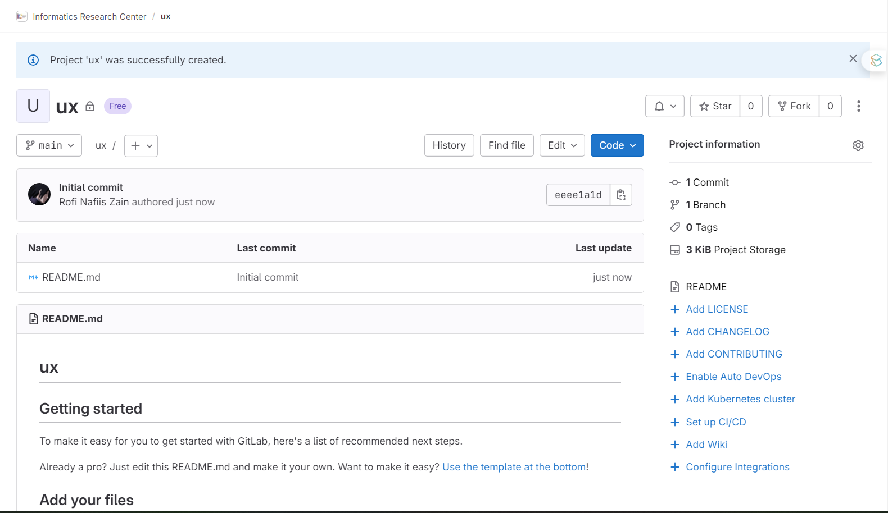
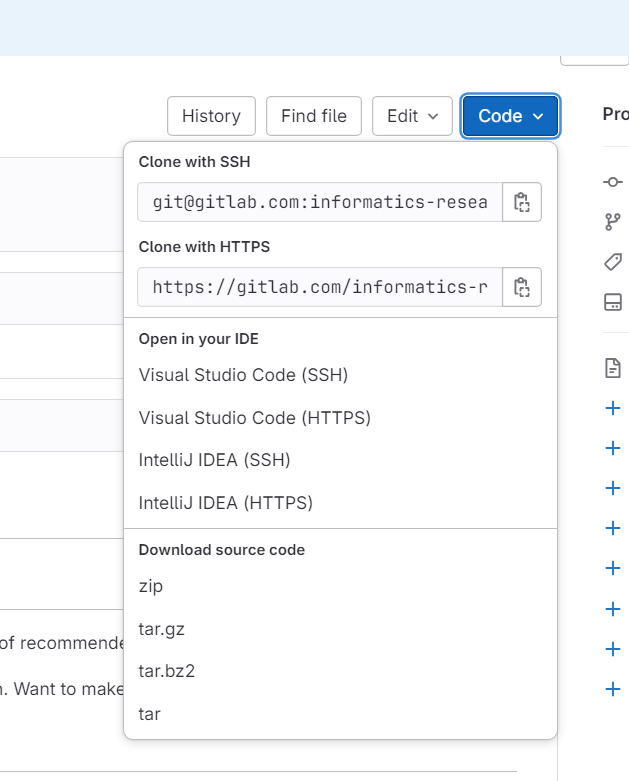
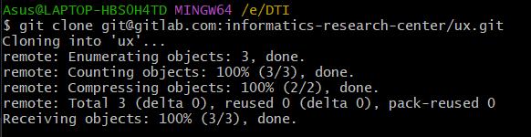
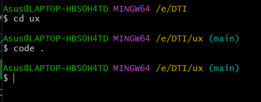

## Dokumentasi Docker

1. Buka Gitlab, dan buat repo baru , klik button new project

2. Kemudian pilih create blank project

3. Isi nama repository dan group untuk project URL, kemudian klik create project

4. Maka tampilan akan seperti ini 

5. Kemudian clone repository (optional bisa pilih ssh atau http , diusahakan ssh)

6. Clone menggunakan git bash anda

7. Buka project yang sudah diclone melalui visual studio code, untuk cara cepatnya seperti di gambar berikut
