# Dokumentasi Docker
## Persiapan Repository

1. Buka Gitlab, dan buat repo baru , klik button new project

2. Kemudian pilih create blank project

3. Isi nama repository dan group untuk project URL, kemudian klik create project

4. Maka tampilan akan seperti ini 

5. Kemudian clone repository (optional bisa pilih ssh atau http , diusahakan ssh)

6. Clone menggunakan git bash anda

7. Buka project yang sudah diclone melalui visual studio code, untuk cara cepatnya seperti di gambar berikut

8. Kemudian isi project anda dengan skeleton dari github.com/gocroot/gocroot
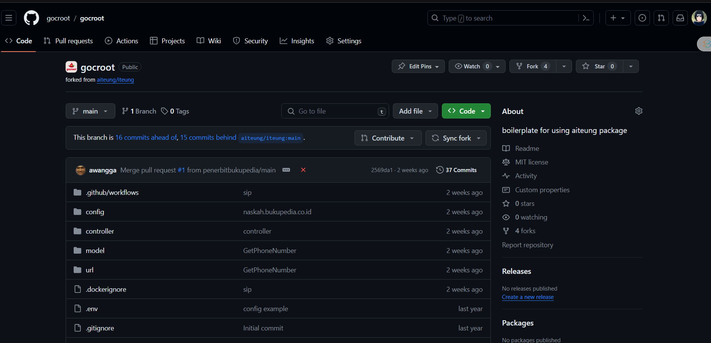
9. Lalu download ZIPnya, kemudian ekstrak file pada folder project seperti pada gambar berikut ini
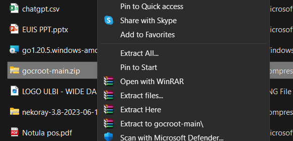
10. Kemudian, pindahkan isi folder ke dalam folder ux (project awal)
11. Selanjutnya, lakukan go mod tidy
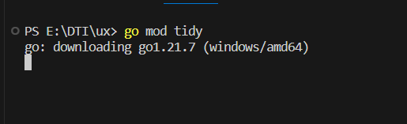
12. Jika program tidak berjalan atau too long respond, hapus file go mod dan go.sum kemudian lakukan langkah berikut
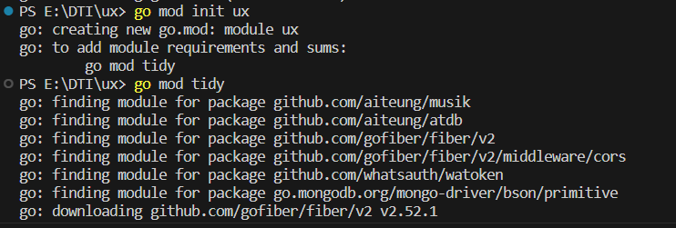
13. Jalankan Nekoray
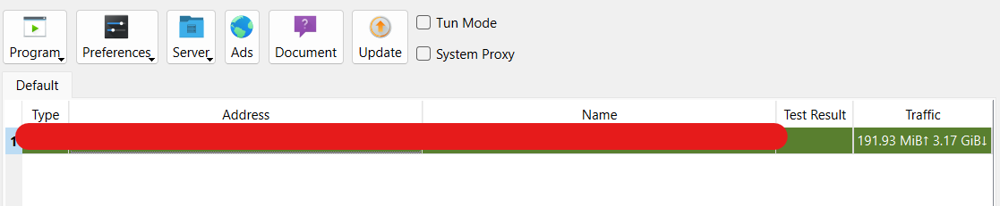
14. Jika nekoray anda berada di jaringan lokal lakukan nslookup pada command line
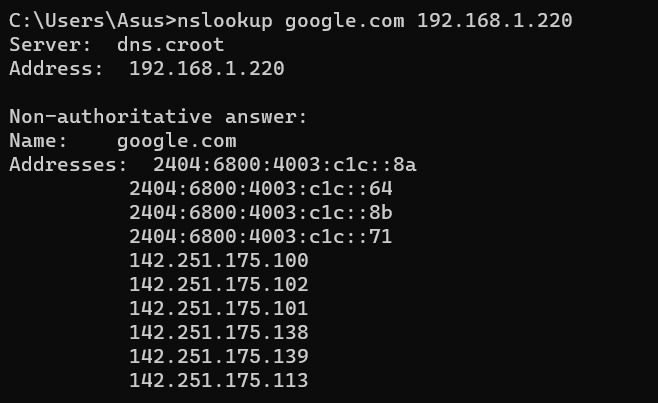
15. Ubah DNS pada jaringan internet anda, Untuk windows masuk ke WIFI settings > Edit DNS
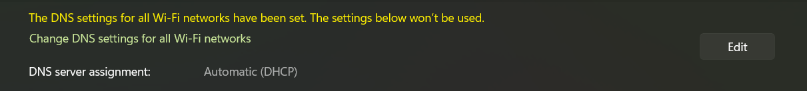
16. Ubah ke Manual dan pilih IPv4
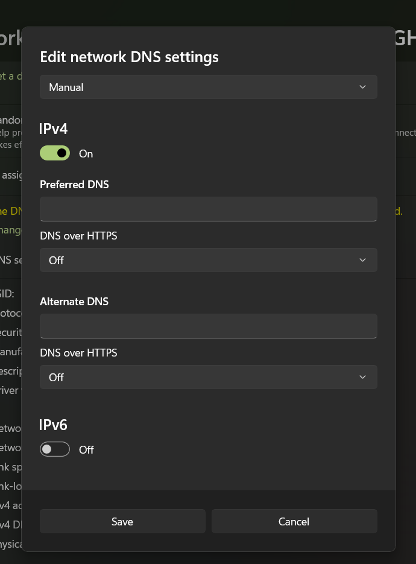
17. Masukan dns address hasil nslookup
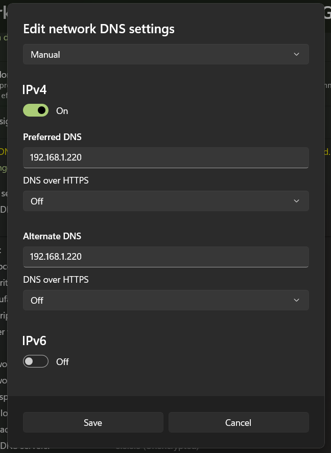
15. Jalankan program dengan perintah go run .
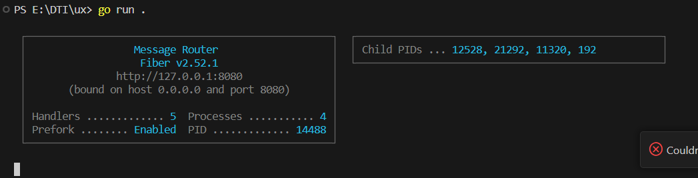
17. Buka browser anda kemudian akses local yang ada pada tampilan fiber vs code
18. Jika Berhasil tampilan browser seperti ini
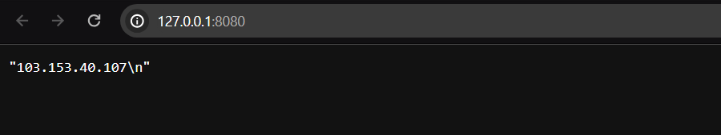

## Deploy Docker
1. Buat file Dockerfile pada project anda
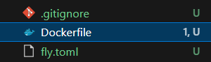
2. Akses Hub.docker.com kemudian cari golang
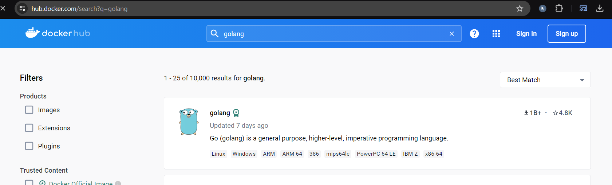
3. Pilih tag yang akan dipakai
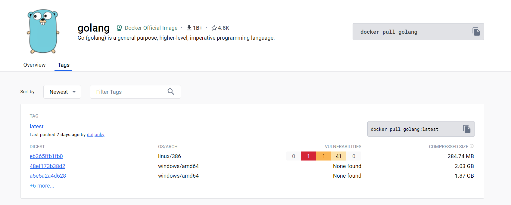
4. Kemudian pilih latest atau versi yang akan digunakan, selanjutnya copy tagnya
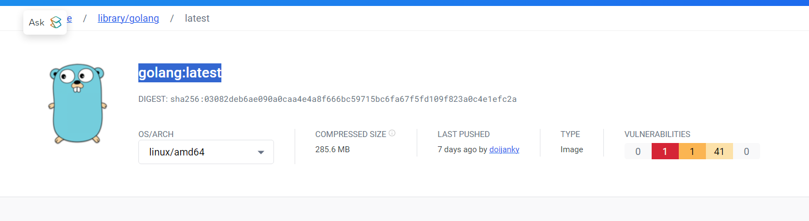
5. Masukan tag ke dockerfile anda
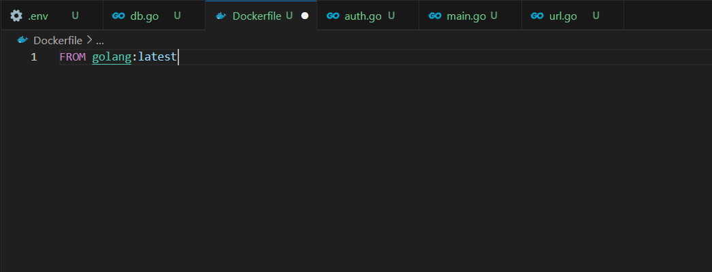
6. Buat WORKDIR terlebih dahulu
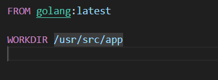
7. buat COPY TAG
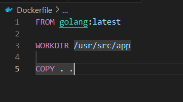
8. Buat RUN sesuai dengan file main anda
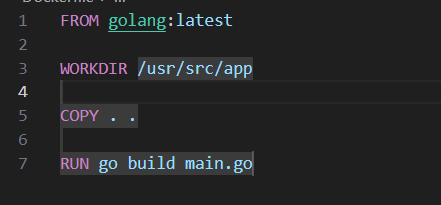
9. Kemudian cari DEBIAN di hub docker
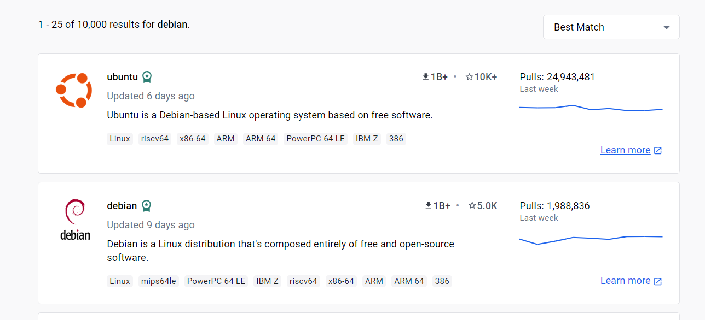
10. ambil tag seperti pada saat hub golang sebelumnya, pilih tag stable-slim
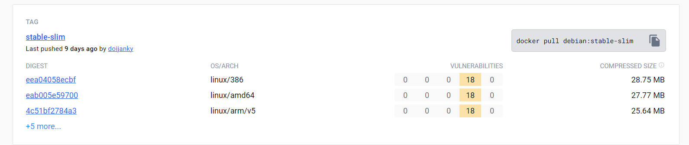
12. Pastikan file dockerfile anda seperti gambar berikut
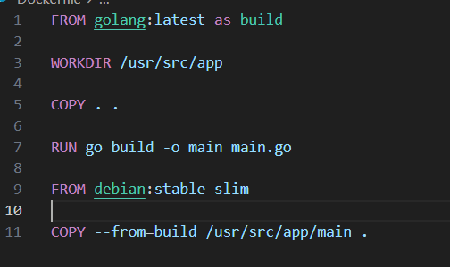
13. Kemudian buat EXPOSE untuk port yang akan digunakan dan CMD diisi oleh nama file hasil build
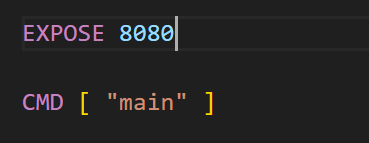
14. PUSH semua file yang ada langsung ke repository anda


## Setting CI/CD
1. Buka gitlab, dan masuk ke menu setting CI/CD
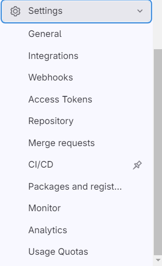
2. Pilih Menu Runner
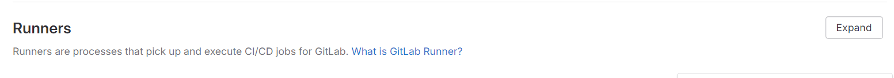
3. Clik New Project runner
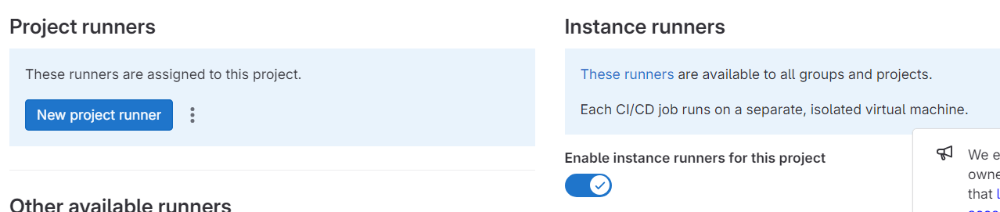
4. ceklis run untag jobs
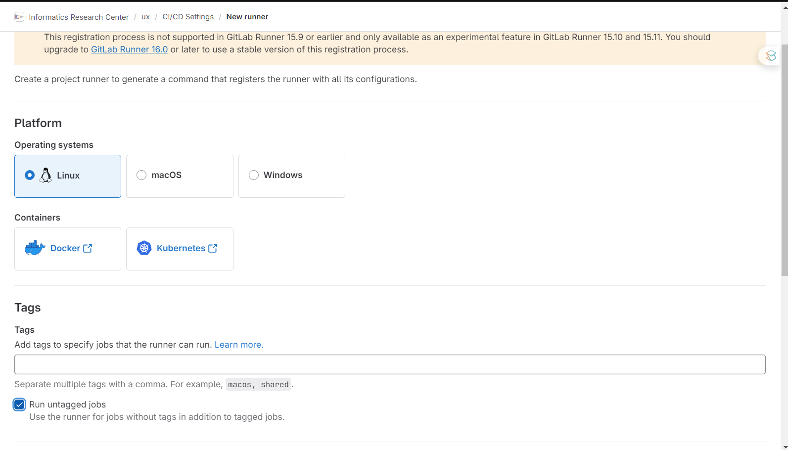
5. Ceklis lock to current project
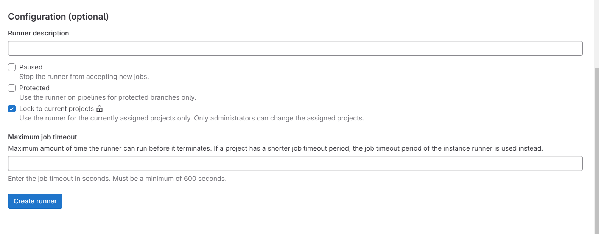
6. Masuk ke git bash dan server docker
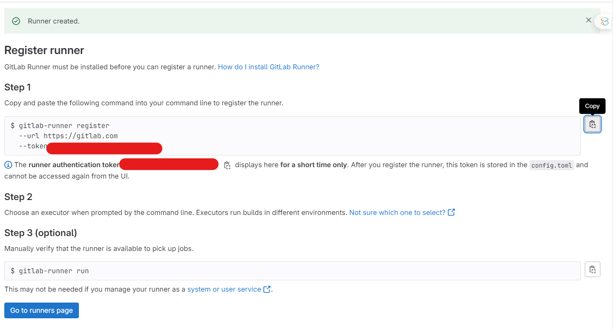
7. Register runner
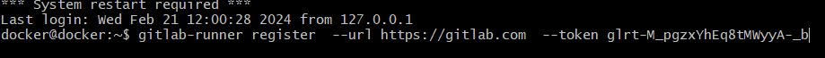
8. Kemudian lakukan enter sebanyak 2 kali dan pilih shell
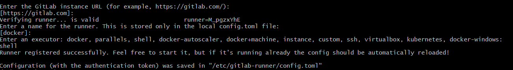
9. Kembali ke runner page, dan pastikan runner sudah muncul dan seperti pada gambar berikut
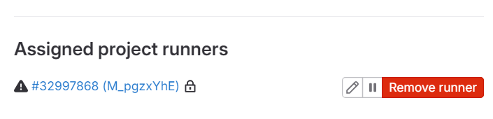
10. Buat Docker compose, ubah container sesuai dengan nama project anda 
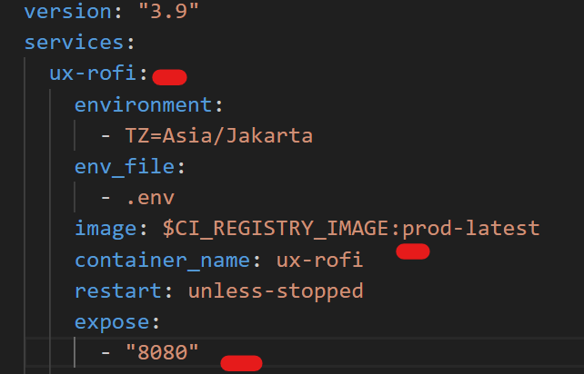
11. Ubah IP sesuai dengan IP kosong
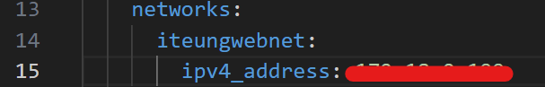
12. Pada file DOckerfile tambahkan dumb init
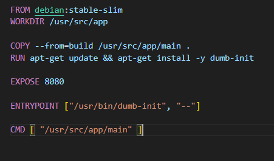

### Gitlab CI
1. Konfigurasikan gitlab ci seperti pada gambar berikut
```yml

#Setting environment variable runner
variables:
  GIT_DEPTH: 1

#Tahapan build
stages:
  - build
  - deploy


#job untuk build
build-docker:
  #Hanya running di branch main
  only:
    - main
  #tahapan build
  stage: build
  #Perintah yang dijalankan untuk build
  script:
    - docker build -t $CI_REGISTRY_IMAGE:prod-latest -f Dockerfile .
    - docker login -u $CI_DEPLOY_USER -p $CI_DEPLOY_PASSWORD $CI_REGISTRY
    - docker push $CI_REGISTRY_IMAGE:prod-latest
  #konfigurasi ketika gagal
  retry:
    #maksimum retry
    max: 2
    #kondisi ketika retry
    when:
      - runner_system_failure
      - stuck_or_timeout_failure

#job untuk deploy
deploy:
  #tahapan
  stage: deploy
  #hanya menjalankan branch main
  only:
    - main
    #Perintah yang dijalankan untuk deploy
  script:
    - docker login -u $CI_DEPLOY_USER -p $CI_DEPLOY_PASSWORD $CI_REGISTRY
    - docker pull $CI_REGISTRY_IMAGE:prod-latest
    - docker-compose -f docker-compose.yml up -d
    - docker image prune -f
```

## Setting Deploy key
1. Tambahkan deploy token pada menu Repository > deploy tokens
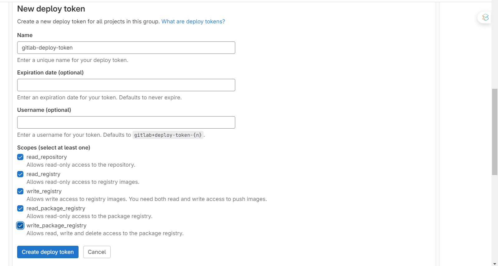

- Setelah semuanya sudah disetting push semua file ke repository, dan akses IP yang tadi sudah disimpan pada docker compose

